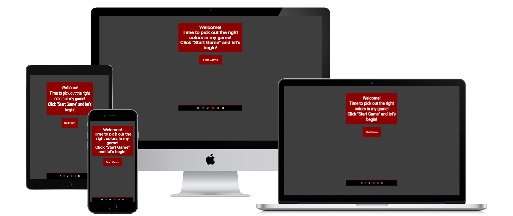

# color-game

The Color Game is made to give people a chanse to play a game and learn RBG values at the same time.

The site can be viewed on GitHub pages [here](https://niborgnu.github.io/color-game/)

---
---

### First Time Visitor Goals:
* As a First Time visitor, I want to easily understand the main purpose of the site, so I can learn more about the content.
* As a First Time visitor, I want to find out about how to play the game.
* As a First Time Visitor, I want to be able to easily navigate through the website.
* As a First Time Visitor, I want to be able to go to social platforms directly from the site.
* As a First Time Visitor, I want to be able to learn the rules.

### Returning Visitor Goals
* As a Returning Visitor, I want to be able to play diffrent difficulties.

