# color-game

The Color Game is made to give people a chance to play a game and learn RGB values at the same time.

The site can be viewed on GitHub pages [here](https://niborgnu.github.io/color-game/)

---
---

### First Time Visitor Goals:
* As a First Time visitor, I want to easily understand the main purpose of the site, so I can learn more about the content.
* As a First Time visitor, I want to find out about how to play the game.
* As a First Time Visitor, I want to be able to easily navigate through the website.
* As a First Time Visitor, I want to be able to go to social platforms directly from the site.
* As a First Time Visitor, I want to be able to learn the rules.

### Returning Visitor Goals
* As a Returning Visitor, I want to be able to play diffrent difficulties.

---

## Features

### Existing Features

+ #### Start Game Button
    - Positioned in the Header Below the Welcome Text
    - A button to hide the start screen and show the game
    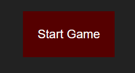

+ #### Game Board
    - Title with the text Guess the Color in
    - RGB value of the color you need to find
    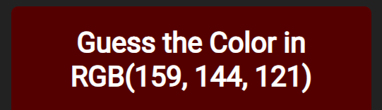
    - Menu bar
        * Reset Game - Resets the game colors and the wright wrong counter
        * Easy - Easy level showing 3 cubes of color randomly generated from an array to choose from
        * Normal - Normal level showing 6 cubes of color randomly generated from an array to choose from
        * Hard - Hard  level showing 9 cubes of color randomly generated from an array to choose from
        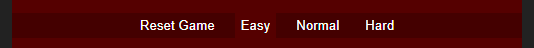
    - Right/wrong counter and a message if player chooses wrong color
    

+ #### Color to choose from
    - 3-9 cubes of random generated colors to choose from
    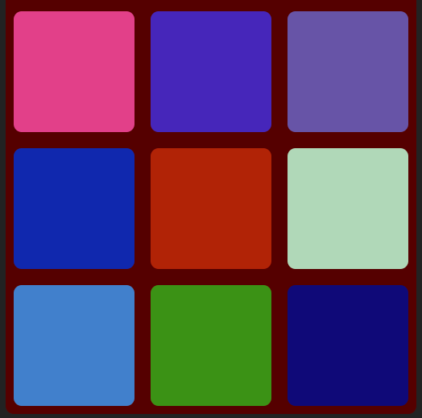

+ #### Rules button 
    - A button to show the rules in a pop up message
    
    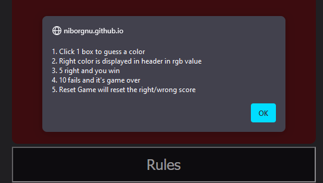

+ #### Footer 
    - Text: Made by Robin Ung (author). Have fun and play!
    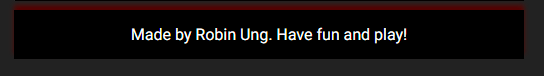

---

### Features Left to Implement
    
+ #### Impliment a HEX alternative to choose from instead of RGB

---

## Flowchart

The flowchart represent the logic of the application:

  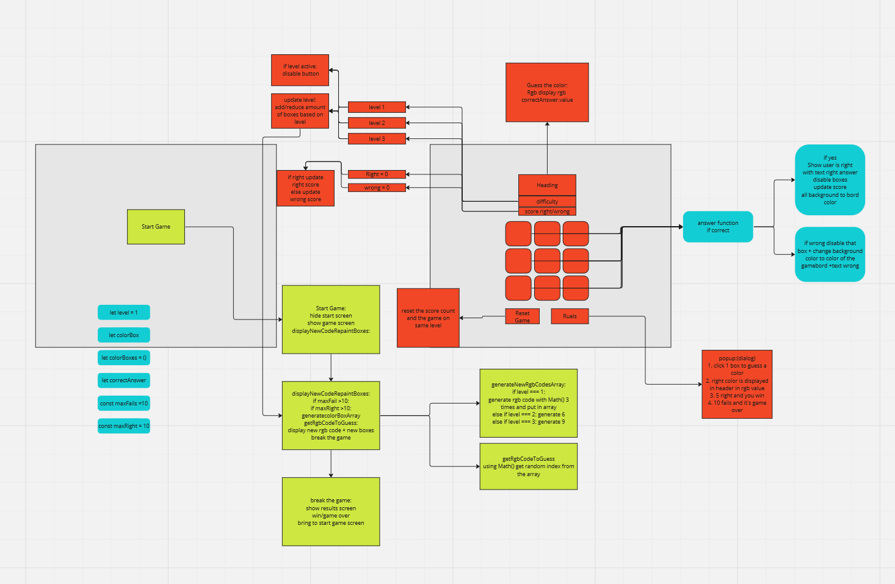

---

## Technologies Used

- [Favicon](https://icons8.com/icons/set/witch) was    used to add an icon in the tab.
- [HTML](https://developer.mozilla.org/en-US/docs/Web/) was used as the foundation of the site.
- [CSS](https://developer.mozilla.org/en-US/docs/Web/) - was used to add the styles and layout of the   site.
- [CSS Flexbox](https://developer.mozilla.org/en-US/docs/Learn/CSS/CSS_layout/Flexbox) - was used to   arrange items symmetrically on the pages.
- [Miro](https://miro.com/) - was used to make flowchart for functions.
- [JS](https://www.w3schools.com/js/) - was used to add interactivity to the site.
- [VSCode](https://code.visualstudio.com/) was used as the main tool to write and edit code.
- [Git](https://git-scm.com/) was used for the version control of the website.
- [GitHub](https://github.com/) was used to host the   code of the website.
- [Photoshop](https://www.adobe.com/products/photoshop.html) was used to resize images for the README file.

---

## Testing

## Validator testing
+ ### HTML
    - No errors or warnings were found when passing through the official [W3C](https://validator.w3.org/) validator.
    
    

+ ### CSS
    - No errors were found when passing through the official [W3C (Jigsaw)](https://jigsaw.w3.org/css-validator/#validate_by_uri) validator. 1 warning was found 

    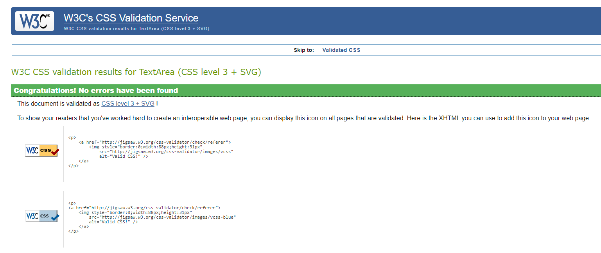

+ ### JS
    - No errors were found when passing through the official [JSHint](https://jshint.com/) validator 
    - except the warnings that 

    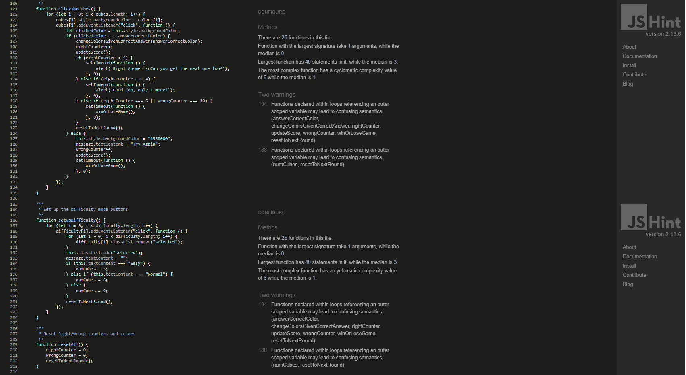

---

### Compatibility And Responsiveness

In order to confirm the correct functionality and appearance:

+ The website was tested on the following browsers: Chrome, Firefox, Edge

    - Chrome

    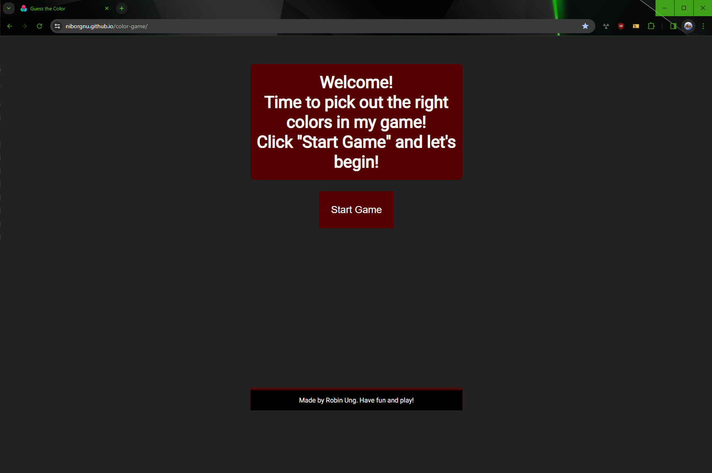

    - Firefox

    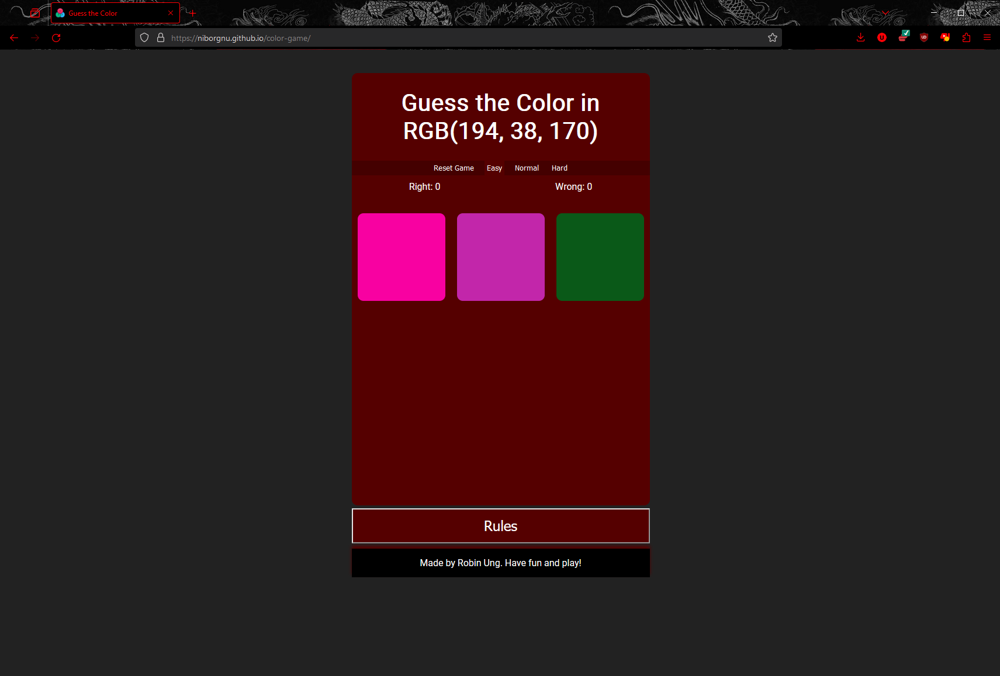

    - Edge

    

---

+ ## LightHouse report

    - Using lighthouse in dev tools I confirmed that the website is performing well, accessible, and the colors and fonts chosen are readable.

    